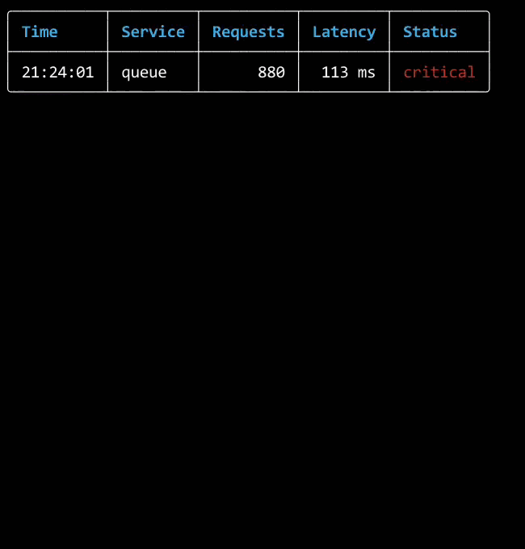
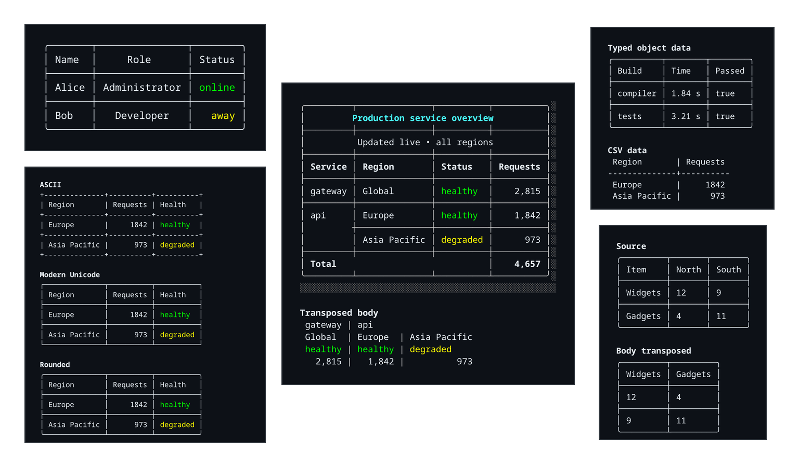
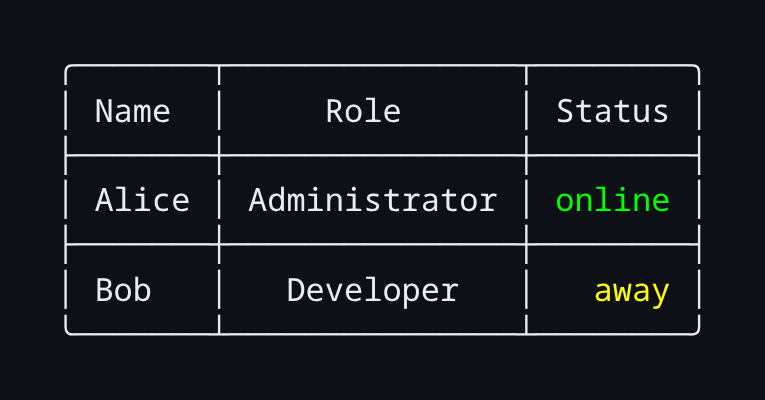
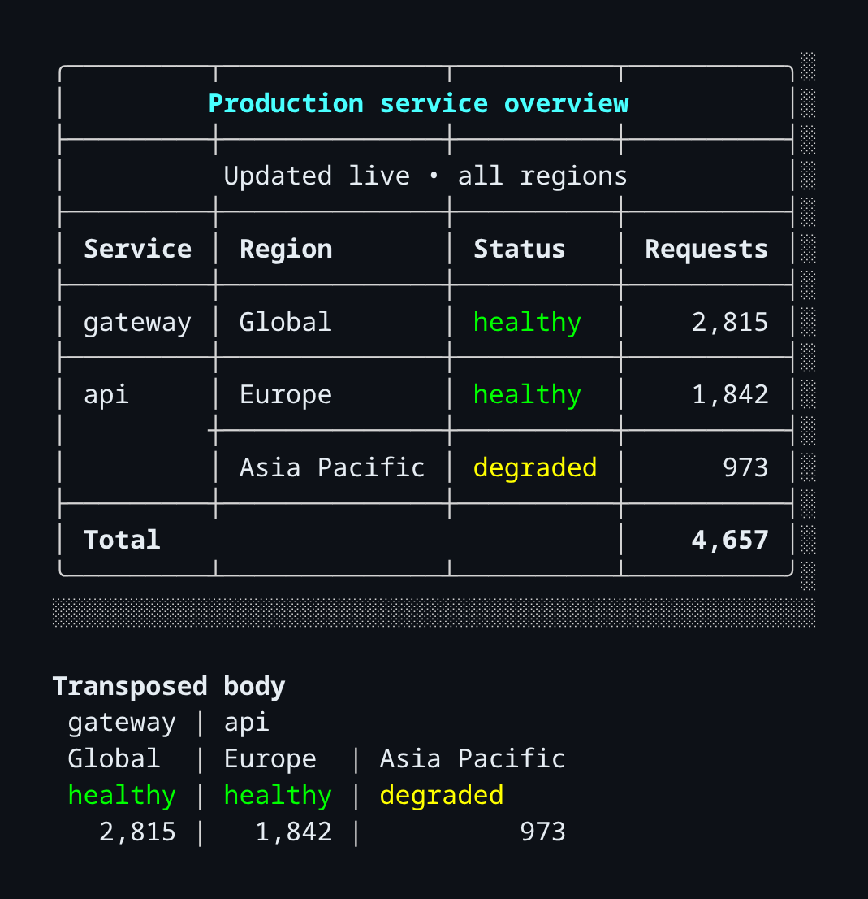
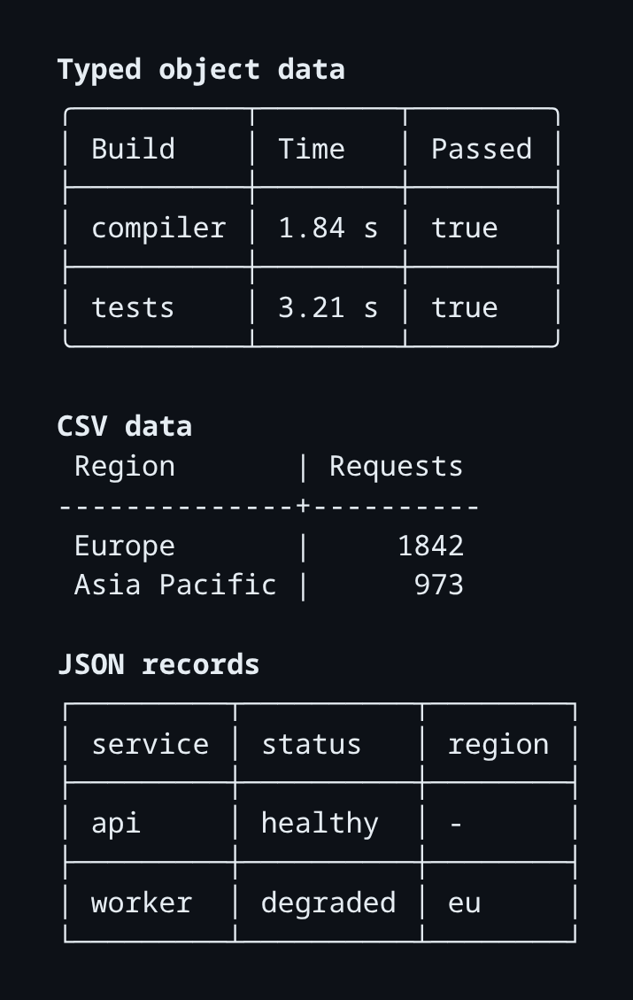
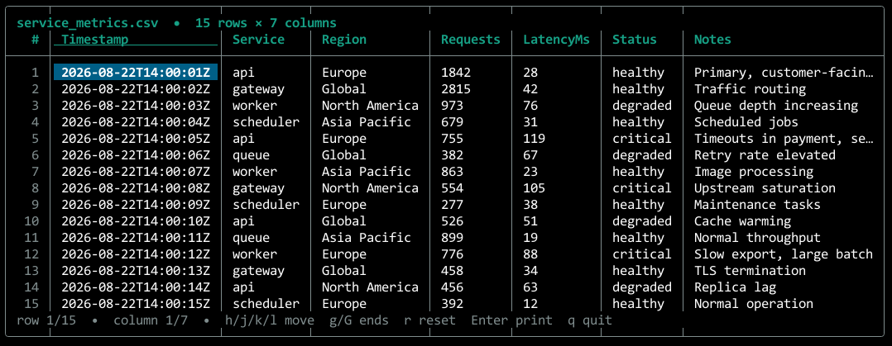
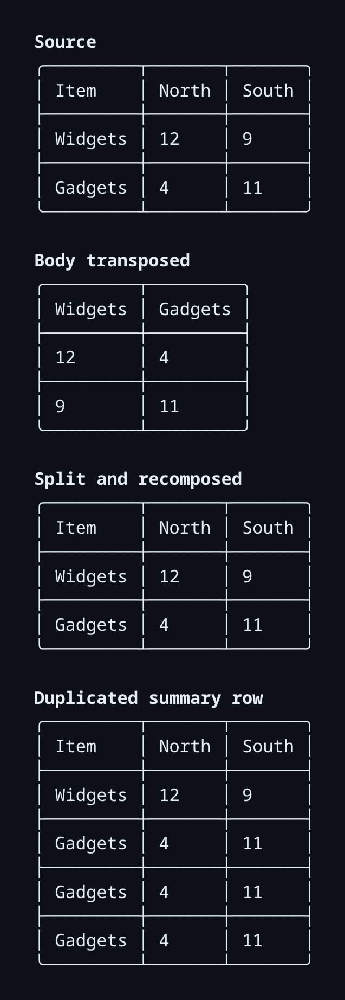
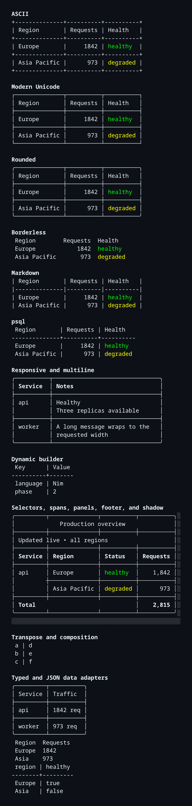

# terminal_tables

Responsive, styled, and live terminal tables for Nim.

`terminal_tables` is a pure-Nim toolkit for static reports, advanced layouts,
resize-safe dashboards, and rolling real-time feeds. It renders to strings,
has no import-time side effects, and understands ANSI styling, OSC hyperlinks,
Unicode, and terminal-cell width.

<p align="center">
  
</p>

<p align="center">
  
</p>

## Platform support

`terminal_tables` has been tested on Linux and Windows. It should also work on
macOS through its standard POSIX terminal and ANSI/VT support, but macOS has not
yet been tested directly.

## Requirements

- Nim 2.0.0 or newer
- [`terminal_styles`](https://github.com/titanomachy/terminal-styles) 0.1.0 or newer, installed from GitHub
- No runtime dependencies beyond `terminal_styles`

## Contents

- [Platform support](#platform-support)
- [Requirements](#requirements)
- [Installation](#installation)
- [Quick start](#quick-start)
- [Features](#features)
- [Models and builders](#models-and-builders)
- [Layout and styling](#layout-and-styling)
- [Advanced tables](#advanced-tables)
- [Data adapters](#data-adapters)
- [Transformations](#transformations)
- [Live tables](#live-tables)
- [Rendering](#rendering)
- [Examples and documentation](#examples-and-documentation)
- [Development](#development)

## Installation

Install the current source version with Nimble:

```sh
nimble install https://github.com/titanomachy/terminal-styles
nimble install https://github.com/titanomachy/terminal-tables
```

`terminal_styles` is installed directly from its
[GitHub repository](https://github.com/titanomachy/terminal-styles) because it
is not yet listed in the Nimble package directory.

Then import the complete core API:

```nim
import terminal_tables
```

The main module also re-exports `terminal_styles`, so colors, reusable styles,
ANSI stripping, and display-width helpers do not need a second import. Typed
objects and CSV/JSON parsing use opt-in modules to keep macros and parsers out
of the core facade.

## Quick start

```nim
import terminal_tables

var table = initTable(["Name", "Role", "Status"])
table.addRow("Alice", "Administrator", green("online"))
table.addRow("Bob", "Developer", yellow("away"))

table.theme = roundedTheme
table.column(1).alignment = alignCenter
table.column(2).alignment = alignRight

echo table.render(maxWidth = 60)
```

<p align="center">
  
</p>

## Features

| Area | Support |
|---|---|
| Table model | Public `Table`, `Row`, `Column`, and `Cell` value types |
| Layout | Responsive widths, wrapping, truncation, padding, margins, and alignment |
| Styling | Cascading ANSI styles, six themes, custom borders, and shadows |
| Structure | Titles, panels, footers, horizontal spans, and vertical spans |
| Selection | Rows, columns, cells, segments, predicates, and selector unions |
| Transformation | Transpose, rotation, composition, merge, extraction, and duplication |
| Data | Compile-time object conversion plus CSV and JSON adapters |
| Live output | Full-screen and in-place redraws, resize handling, and rolling rows |
| Text handling | ANSI-safe and OSC-8-safe Unicode terminal-cell measurement |

## Models and builders

Headers establish a fixed column count. Ragged rows raise `ValueError` when
they are added. Headerless tables specify their column count explicitly:

```nim
var table = initTable(["Key", "Value"])
table.addRow("language", "Nim")

var log = initTable(Positive(3))
log.addRow("12:00", "info", "started")
```

Use `TableBuilder` when values arrive incrementally or their shape is known
only at runtime. `build` validates the completed data set.

```nim
var builder = initTableBuilder(["Key", "Value"])
builder.addCell("phase")
builder.addCell("2")
builder.finishRow()
builder.addRow("status", "complete")

let table = builder.build()
```

## Layout and styling

### Themes

The built-in themes are `asciiTheme`, `modernTheme`, `roundedTheme`,
`borderlessTheme`, `markdownTheme`, and `psqlTheme`.

```nim
table.theme = modernTheme
```

`customTheme` accepts a `BorderSet` and visibility flags. Every active border
glyph must occupy exactly one terminal cell; invalid and multiline borders are
rejected before rendering.

### Width and overflow

Each column can use one content-width rule:

```nim
table.columns[0].width = contentWidth
table.columns[1].width = fixedWidth(16)
table.columns[2].width = minimumWidth(8)
table.columns[3].width = maximumWidth(24)
table.columns[4].width = percentageWidth(30)
```

Widths describe the content area. Padding, separators, borders, margins, and
shadows are included automatically when fitting the complete table.
`render(maxWidth = 0)` uses natural widths; a positive width responsively
shrinks flexible columns and raises `ValueError` if fixed or minimum
constraints cannot fit.

Lower width priorities shrink first. Columns default to priority zero:

```nim
table.column(0).setWidthPriority(10) # preserve longer
table.column(2).setWidthPriority(-5) # shrink first
```

Word wrapping is the default. Character wrapping and truncation preserve ANSI
styles and OSC hyperlinks:

```nim
table.overflow = overflowWrapCharacters
# or:
table.overflow = overflowTruncate
table.truncationSuffix = "..."
```

### Alignment, padding, and margins

Horizontal alignment uses `alignLeft`, `alignCenter`, and `alignRight`.
Multiline cells use `valignTop`, `valignCenter`, and `valignBottom`.

```nim
table.column(1).setAlignment(alignRight)
table.row(0).setVerticalAlignment(valignCenter)
table.cell(0, 0).setAlignment(alignCenter)

table.padding = initCellPadding(left = 2, right = 2)
table.margin = initTableMargin(left = 1, right = 1, top = 1, bottom = 1)
```

Settings cascade from table to column to row to cell. The setter procedures
record explicit overrides, including left, top, and zero values that would
otherwise mean "inherit."

### Styles and shadows

Styles cascade at table, column, row, and cell scope. The most specific color
wins while text attributes are combined. Borders are styled independently.

```nim
table.style = initTerminalStyle(attributes = {taBold})
table.column(0).style = initTerminalStyle(foreground = colorCyan)
table.cell(0, 1).style = initTerminalStyle(background = indexedColor(235))
table.borderStyle = initTerminalStyle(foreground = colorBrightBlack)

table.setShadow(initShadow(
  right = 1,
  bottom = 1,
  glyph = "░",
  style = initTerminalStyle(foreground = colorBrightBlack)
))
```

Set `table.useColor = false` to strip ANSI already present in values and omit
configured styles for redirected or plain-text output.

## Advanced tables

Titles and panels are full-width cells. Top panels appear before the header;
bottom panels appear after body rows and before the footer.

```nim
table.setTitle("Production status")
discard table.addPanel("Updated 12:00 UTC", panelTop)
table.setFooter(["Total", "", "42"])
```

Horizontal and vertical spans are anchored by their top-left cell. Headers and
footers can span horizontally. Covered values remain in the model and become
visible again after `clearSpan`.

```nim
table.cell(0, 0).setSpan(columns = 2)
table.cell(1, 0).setSpan(rows = 3)
table.footerCell(0).setSpan(columns = 3)
```

Spans cannot overlap, leave their section, or cross between header, body, and
footer. Wrapping and ANSI-aware measurement use the combined span width, and
internal borders are omitted.

Selectors make bulk changes reusable and composable. Body indexes are
zero-based; column selectors also include that column in the header and
footer.

```nim
table.highlight(headerSelector() or footerSelector(),
  initTerminalStyle(attributes = {taBold}))
table.align(columnSelector(2), alignRight)
table.pad(segmentSelector(0, 0, 2, 1), initCellPadding(2, 2))

let failures = predicateSelector(proc(context: CellContext): bool =
  context.cell.text == "failed")
table.highlight(failures,
  initTerminalStyle(foreground = colorBrightRed))
```

`matchingCells` returns stable model addresses. `apply` accepts a custom
closure when the built-in highlighting, alignment, and padding modifiers are
not enough. Selector unions modify each matching cell once.

<p align="center">
  
</p>

The exact layout and span contracts are documented in
[`docs/advanced-layout.md`](docs/advanced-layout.md).

## Data adapters

### Typed objects

Import `terminal_tables/typed_data` to convert homogeneous object collections
at compile time. The optional module re-exports the core API.

```nim
import terminal_tables/typed_data

type Build = object
  internalId: int
  name: string
  durationMs: int

proc seconds(value: int): string =
  $(value.float / 1000) & " s"

let builds = @[
  Build(internalId: 101, name: "compiler", durationMs: 1840),
  Build(internalId: 102, name: "tests", durationMs: 3210)
]

let table = tableFromObjects(builds,
  tableColumn(name, "Build"),
  tableColumn(durationMs, "Time", seconds))
```

Column specifications define exact selection and order, so omitted fields are
hidden. Without specifications, fields are discovered in declaration order.
Unknown or duplicate fields and incompatible formatters fail at compile time.

### CSV and JSON

```nim
import terminal_tables/csv_adapter
let csvTable = tableFromCsv("Name,Score\nAda,10")

import terminal_tables/json_adapter
let jsonTable = tableFromJson("""[{"name":"Ada","score":10}]""")
```

CSV accepts strings or files and uses Nim's standard parser. JSON expects an
array of objects and can infer a stable union of keys or use an explicit column
list. Detailed contracts and error behavior are in
[`docs/typed-data.md`](docs/typed-data.md).

<p align="center">
  
</p>

### Interactive CSV viewer

The current APIs are enough to build a compact,
[csvlens-inspired](https://github.com/YS-L/csvlens) viewer. The example combines
CSV parsing, a height-aware row and column viewport, selected cell styling,
responsive full-screen redraws, and Nim's standard terminal input:

```sh
nim c -r --path:src examples/csv_viewer.nim -- examples/data/service_metrics.csv
```

The repository includes
[`service_metrics.csv`](examples/data/service_metrics.csv), with enough rows
and columns to exercise both viewport directions. Run the viewer without a
filename to use its embedded sample data. Use `h`, `j`, `k`, and `l` to move,
`g`/`G` to jump to the first or last row, `0`/`$` for the first or last column,
`r` to reset, Enter to print the selected value, and `q` to quit.

<p align="center">
  
</p>

This demonstrates that `terminal_tables` can provide the rendering layer for
an interactive CSV application. A full csvlens-class viewer still needs an
application/TUI layer for cross-platform key events, efficient virtualized
data access, search and filtering prompts, sorting, frozen columns, row marks,
clipboard integration, streaming input, and file watching.

`markdownTheme` produces Markdown-style terminal text. Semantic Markdown and
HTML exporters are intentionally deferred until advanced spans, panels,
multiline values, styling, and hyperlinks have an explicit lossless contract.

## Transformations

Transformations return independent values and never mutate their input:

```nim
let columnsAsRows = table.transpose()
let clockwise = table.rotateClockwise()
let counterClockwise = table.rotateCounterClockwise()
let upsideDown = table.rotate180()

let combined = horizontalConcat(left, right)
let stacked = verticalConcat(top, bottom)
let filled = merge(base, overlay) # overlay fills empty body cells
```

Rotation preserves cell styles and span geometry. It removes headers and
footers because those concepts change axes; titles and panels stay attached.

Use `extractRows`, `removeRows`, `duplicateRow`, and `splitRows` for row edits.
The corresponding column procedures are `extractColumns`, `removeColumns`,
`duplicateColumn`, and `splitColumns`. Axis edits reject spans on that axis so
they cannot silently cut a merged region.

<p align="center">
  
</p>

## Live tables

`LiveTable` pairs a mutable `Table` with an explicit terminal lifecycle. Your
application owns data production and timing; the library starts no timer or
background thread.

```nim
import std/os
import terminal_tables

var table = initTable(["Service", "Requests", "Status"])
table.addRow("api", 0, "starting")

var live = initLiveTable(table)
live.startLive()
try:
  for requests in [42, 57, 63]:
    live.updateCell(0, 1, requests)
    live.updateCell(0, 2, green("healthy"))
    live.draw()
    sleep(250)
finally:
  live.stopLive()
```

Only `draw` publishes a frame, so multiple updates can be batched. `renderFrame`
returns the responsive frame without taking ownership of the terminal.

Full-screen mode is the default. It detects terminal width on every draw,
overwrites the previous frame, and uses the terminal's alternate screen when
available. On Windows 10 and newer, live sessions enable virtual-terminal
processing and restore the original console mode when they stop. Set
`options.mode = ltmInPlace` to preserve content above the table. In-place
redraws account for physical rows introduced by wrapping after a resize.

For rolling feeds, cap the retained body rows:

```nim
var options = initLiveTableOptions()
options.maxRows = 20

var live = initLiveTable(initTable(["Time", "Event"]), options)
live.addRow("12:00:01", "worker started")
```

Set `availableWidth` for deterministic rendering or leave it at zero for live
detection. `LiveTable` is intentionally not synchronized: keep mutation and
`draw` on one rendering thread, and pass immutable updates or protected
snapshots from background producers.

### Live demo

<p align="center">
  
</p>

The animation runs [`examples/live_data_table.nim`](examples/live_data_table.nim),
which simulates incoming service metrics, retains a bounded rolling window,
responds to terminal resizing, and restores terminal state on exit.

## Rendering

The core renderer is deterministic and never queries the environment:

```nim
let natural = table.render()
let fitted = table.render(maxWidth = 80)
```

`renderToTerminalWidth(fallbackWidth = 80)` explicitly queries terminal width
at call time. `table.print(maxWidth = 80)` writes the rendered string followed
by a newline.

## Examples and documentation

Every public feature family has a finite, runnable example:

| Example | Demonstrates |
|---|---|
| [`basic_table.nim`](examples/basic_table.nim) | Core model, rounded theme, color, and alignment |
| [`advanced_tables.nim`](examples/advanced_tables.nim) | Selectors, panels, spans, decoration, and transpose |
| [`csv_viewer.nim`](examples/csv_viewer.nim) | Interactive CSV viewport, cell selection, and keyboard navigation |
| [`data_adapters.nim`](examples/data_adapters.nim) | Typed objects, CSV, and JSON |
| [`transform_tables.nim`](examples/transform_tables.nim) | Transpose, split, composition, and duplication |
| [`live_data_table.nim`](examples/live_data_table.nim) | Responsive rolling live data and terminal restoration |
| [`all_tables.nim`](examples/all_tables.nim) | Complete static feature showcase |

<details>
<summary><strong>Open the complete static showcase</strong></summary>

<p align="center">
  
</p>

</details>

Further reference material:

- [Public API example map](docs/public-api.md)
- [Advanced layout contract](docs/advanced-layout.md)
- [Typed data contracts](docs/typed-data.md)
- [Changelog](CHANGELOG.md)
- [Contributing](CONTRIBUTING.md)
- [Third-party notices](THIRD_PARTY_NOTICES.md)
- [License](LICENSE)

## Development

The examples use relative source imports, so they compile directly from a
checkout before the package is installed:

```sh
nimble check
nimble test
nimble examples
nimble docs
```

Run an individual example with:

```sh
nim c -r examples/basic_table.nim
```

The test suite passes explicit widths and does not depend on the developer's
terminal dimensions. New public behavior should include API documentation,
validation, deterministic output tests, and a finite example.

## Acknowledgements

The implementation is original Nim code. Its feature direction is inspired by
the documented API of Rust's [`tabled`](https://github.com/zhiburt/tabled), not
by copied source.

Released under the [MIT License](LICENSE).
